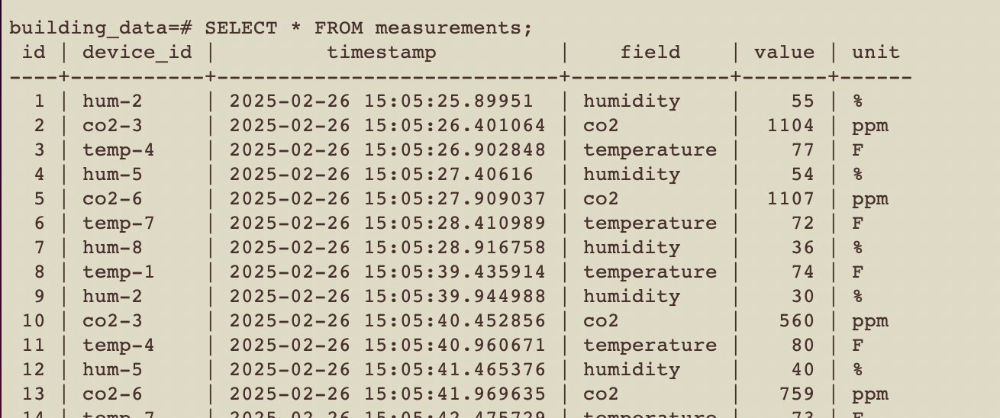

# syyclops-oa
Programming take home assignment for Syyclops. 

In this project, we define a multi-container application to simulate the processing and storage of incoming MQTT data from an array of sensors. To describe this project, we will describe each containerized service (corresponding to the sub-folders)

publishers: 
We define the data-generating process. Namely, we define an abstract "Device" class, that in the future can be extended to match some ontology or connect to some BIM, building ontology, simulation environment, etc. Then we define a range of sample sensors (Temperature, Humidity, CO2) that periodically define json packets. `router.py` is responsible for setting up the actual data communication, defining the device set for our fake building through the broker. 

subscriber:
The central BMS class simulates the message receiver whose role it is to process and store the incoming streams of sensor data. It connects to the MQTT broker and subscribes to topic pertaining to its specific building property. One could imagine same system carrying messages for many buildings. Then it filters relevant messages, cleans them to ensure validity (or set fallback values), and then commits them to a POSTGRES database. 

Database Scheme: We imagine a table of buildings that connect to floor plans, metadata, etc. One property of each building is a list of zones (rooms, thermal divisions, floors, etc.).
Each zone is comprised of a set of devices (each with a defined subclass of Device, as defined in publishsers). Each device has a set of measurements (temperature, humidity, etc.) that stored in its own table. 

Building Table <--One to Many relationship --> Zones <-- One to Many relationship --> Devices <--One to Many relationship --> Measurements

mosquitto: 
The MQTT broker that is responsible for routing data from publisher to subscriber. Not much modificatoin made from the base eclipse-mosquitto:latest image; just specify persistence locations and filepaths. Create a custom docker virtual network called "building-network" that allows all the container processes to communicate with each other via TCP/IP. Every container is attached to it, allowing containers to share an internal DNS. Thus we can connect to names and exposed ports rather than direct IP addresses. 

frontend: 
A simple flask app for viewing the data. Can select a zone and get a table of past 10 measurements. Can easily extend to be more appealing and include visualizations!
